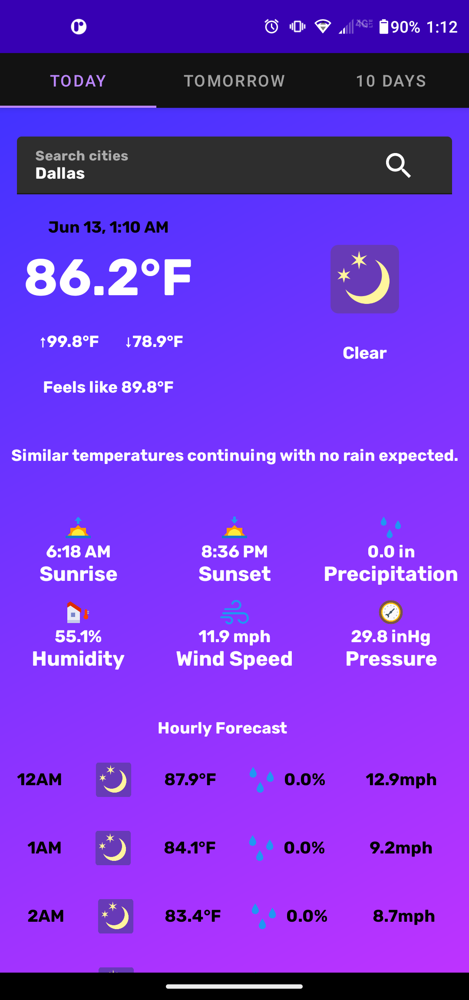
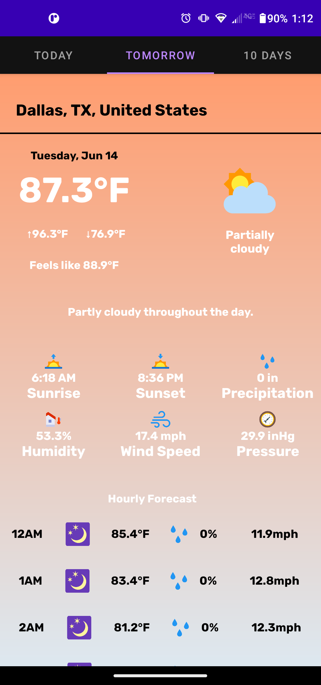

# Weather App
A simple Kotlin-based weather application for Android devices

- Launcher icon used: <a href="https://www.flaticon.com/free-icons/weather" title="weather icons">Weather icons created by Freepik - Flaticon</a>

**Usage**
- Download the APK from Releases and install onto an Android SDK 21+ device
- Alternatively, download code from repository and run in a Kotlin development environment (i.e. IntelliJ, Android Studio)
- **NOTICE:** Users will require a new API key from Visual Crossing as the key provided is invalid.

**Screenshots**

  
  
  

**Requirements:**
- Latest version of Android Studio (Currently Chipmunk 2021.2.1)
- JDK 8
- Android SDK 32
- Supports API Level +21
- 8MB of storage

**Highlights:**

- Uses VisualCrossing's RESTful Weather API
- Simple design
- 10 Day forecast
- Works with any city in the world
- No ads or background tasks

**Libraries & Dependencies:**

- [Supporting libraries]: AppCompat, RecyclerView, CardView, RelativeLayout
- [Play Services]: Used to retrieve weather at current location if location is on
- [Volley]: HTTP library used to send JSON requests to API
- [Picasso]: Image caching library used to concisely and effectively load images
- [Material Design]: will be added later
- [Firebase Core / Crashlytics]: will be later

# License

    Copyright 2022 Joel Pimenta

    Licensed under the Apache License, Version 2.0 (the "License");
    you may not use this file except in compliance with the License.
    You may obtain a copy of the License at

       http://www.apache.org/licenses/LICENSE-2.0

    Unless required by applicable law or agreed to in writing, software
    distributed under the License is distributed on an "AS IS" BASIS,
    WITHOUT WARRANTIES OR CONDITIONS OF ANY KIND, either express or implied.
    See the License for the specific language governing permissions and
    limitations under the License.
